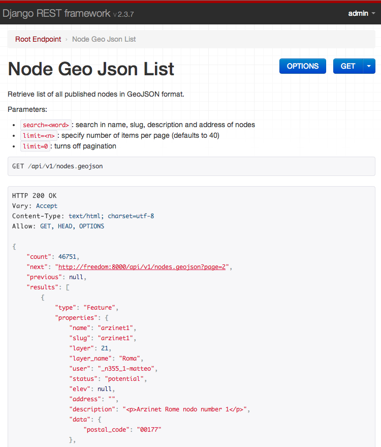
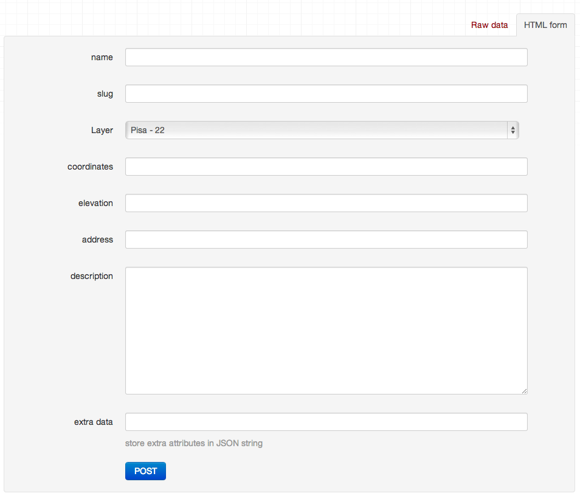
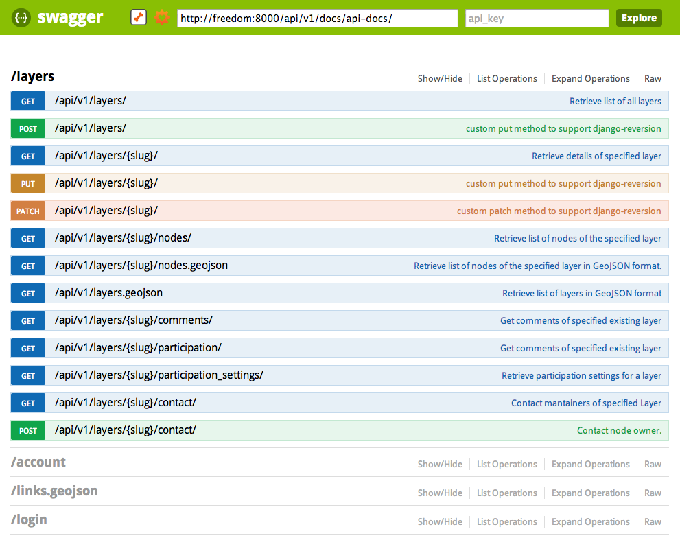

.. _api-label:
***************************
Self documented RESTful API
***************************

.. image:: images/nodeshot-api.png

Nodeshot provides a JSON RESTful API to manage most of the data in its database.

The API is **self-documented**, **browsable** and has two levels of documentation.

By default the API is reachable at **http://localhost:8000/api/v1/**.

Replace *http://localhost:8000* with your actual hostname.

========
Settings
========

``nodeshot.core.api`` is enabled by default in ``nodeshot.conf.settings.INSTALLED_APPS``.

These are the available customizable settings:

 * ``NODESHOT_API_PREFIX``
 * ``NODESHOT_API_APPS_ENABLED``

NODESHOT_API_PREFIX
-------------------

**default**: ``api/v1/``

The API URL prefix.

The following example will expose the API root to **http://localhost:8000/**:

.. code-block:: python

    NODESHOT_API_PREFIX = ""

NODESHOT_API_APPS_ENABLED
-------------------------

**default**:

.. code-block:: python

    [
        'nodeshot.core.nodes',
        'nodeshot.core.layers',
        'nodeshot.core.cms',
        'nodeshot.community.profiles',
        'nodeshot.community.participation',
        'nodeshot.community.notifications',
        'nodeshot.community.mailing',
        'nodeshot.networking.net',
        'nodeshot.networking.links',
        'nodeshot.networking.services',
        'nodeshot.interop.open311',
        'nodeshot.ui.default.api'
    ]

Each nodeshot django app contains some API resources, this setting tells the API
which of those resources should be enabled. By default all of them are enabled.

The following example enables only the API resources of the main modules:

.. code-block:: python

    # settings.py

    NODESHOT_API_APPS_ENABLED = [
        'nodeshot.core.nodes',
        'nodeshot.core.layers',
        'nodeshot.core.cms'
    ]

=================
API Documentation
=================

By default when you open the API you will see the **self-documented** HTML version.

Each resource has a general description of what is its purpose and which operations supports.

The resources which perform write operations will also have an HTML form with which you can experiment and test the API.

There's also another auto generated documentation that makes use of the standard **swagger** format which you can see at **http://localhost:8000/api/v1/docs/**

