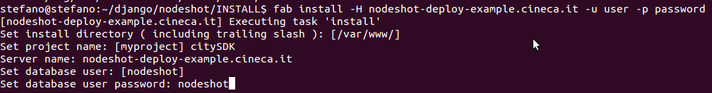
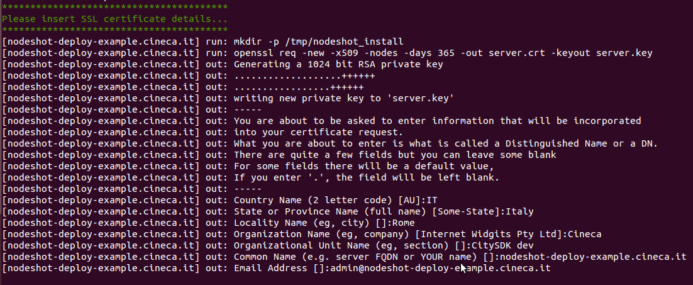
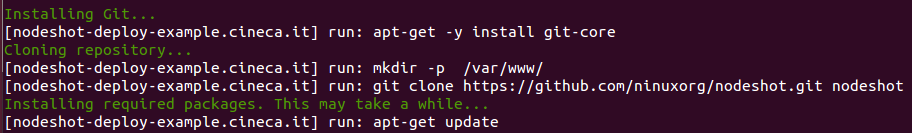
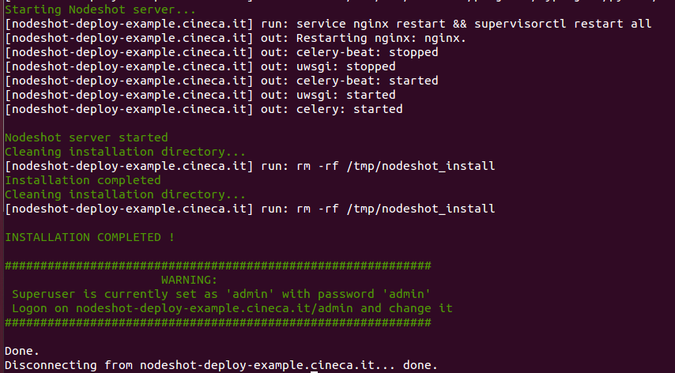

*****************
Automated install
*****************

This section describes how to perform a quick install of Nodeshot on **Ubuntu Server 12.04 LTS**.

.. warning::
    The quick install procedure described below has been tested on a fresh install of **Ubuntu Server 12.04 LTS**.

    If you try it on a server where other applications are running, you might incur in some errors.

    The most typical would be having the port 80 already in use by Apache.

    In this case, you should evaluate if using the :ref:`manual install <manual-install-label>` procedure, in order to exactly tweak Nodeshot configuration, according to your needs.

=============
Prerequisites
=============

To achieve this result, we will be using the `Fabric`_ Python library.

.. _Fabric: http://www.fabfile.org/index.html

If you are working on a machine with pip installed you can install Fabric simply typing::

        pip install fabric

More detailed instructions about Fabric installation can be found `here`_

.. _here: http://www.fabfile.org/installing.html

=================================
Install on existing remote server
=================================

Once Fabric is installed, download the fabfile that will perform the installation from the Nodeshot repository:

https://raw.githubusercontent.com/ninuxorg/nodeshot/master/INSTALL/fabfile.py

and run ( from the directory where you have downloaded the file )::

    fab install -H <remote_host> -u root -p <password>

The install procedure will start, asking you to insert the parameters that will customize your nodeshot instance:

These are the informations you will have to supply to the install procedure:

**Install directory**: the directory where Nodeshot will be installed ( default: /var/www/)

**Project name**: the name for your project ( default: myproject)

**Server name**: the FQDN of your server ( no default )

**Database user**: postgres owner of Nodeshot DB ( default: nodeshot)

**Database user password**: password for postgres owner of Nodeshot DB ( no default )

Next, you will have to supply the details for the SSL certificate that will be used for serving Nodeshot over HTTPS:

That's all you have to do: the installation process will start.

It will take care of installing package dependencies,
creating python virtual env, and configuring the webserver and the other software needed to run Nodeshot.

The installation will take about 5-10 minutes to complete.
As final step, it will start all services and leave you with a full running version of Nodeshot.

A message will remind you to change your admin password from its default value:

==================
Update an instance
==================

To run an update do::

    fab update -H <remote_host> -u root -p <password>

If you need to specify parameters without the need to be prompted do::

    fab update:project_name=<project_name> -H <remote_host> -u root -p <password>

You could also set a different ``root_dir`` with::

    fab update:root_dir=/custom/path/,project_name=<project_name> -H <remote_host> -u root -p <password>

======================================
Install on a VM hosted on your machine
======================================

The above procedure can be also executed on a Virtual Machine following the instructions below.

For this purpose we'll be using `VirtualBox`_  and `Vagrant`_ , a platform for configuring lightweight, reproducible, and portable development environments.

.. _VirtualBox: https://www.virtualbox.org/
.. _Vagrant: http://www.vagrantup.com/

------------
Installation
------------
Informations on how to install **VirtualBox** and **Vagrant** on different platforms can be found on their respective websites.

On a Ubuntu Linux distribution it's as easy as::

        apt-get install virtualbox

        apt-get install vagrant

-------------
Configuration
-------------

**VirtualBox**

You will need to add a private virtual network interface, in order to enable communication between your host and the Vagrant VM::

        VBoxManage hostonlyif create
        VBoxManage hostonlyif ipconfig vboxnet0 --ip <host private ip address. e.g: 192.168.56.1>

**Vagrant**

Configure Vagrant VM network and enable root access on it::

        # Create a directory for your Vagrant VMs
        mkdir vagrantVM_Dir
        cd vagrantVM_Dir
        # Initialize a Ubuntu 12.04 VM ( use hashicorp/precise32 or hashicorp/precise64 depending on your system)
        vagrant init hashicorp/precise64
        # Edit Vagrantfile and create a host-only private network which allows host-only access to the machine
        vim Vagrantfile
        # Uncomment line 27 and change the IP address according to the one you defined for your host
        # e.g. config.vm.network "private_network", ip: "192.168.56.2"

        # Start Vagrant
        vagrant up
        # ssh into VM and abilitate root login
        vagrant ssh
        vagrant@precise64:~$ sudo -i
        root@precise64:~# passwd root
        Enter new UNIX password:
        Retype new UNIX password:
        passwd: password updated successfully

Once completed the above steps, you can run the Nodeshot install procedure as you would do on a remote host::

        pip install fabric
        wget https://github.com/ninuxorg/nodeshot/blob/master/INSTALL/fabfile.py
        fab install -H <VM ip address> -u root -p password
