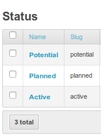

 
=========================
Open 311 API
=========================

Nodeshot comes with a self-documented API, in order to insert nodes, comments, votes or ratings as service requests,
according to the Open 311 standard (http://open311.org/).

---------------
Settings
---------------
The modules ``nodeshot.layers`` , ``nodeshot.nodes`` , ``nodeshot.participation`` and ``nodeshot.open311`` need to be in ``settings.INSTALLED_APPS``::

    INSTALLED_APPS = [
        # dependencies
        'nodeshot.community.participation'
        'nodeshot.core.layers',
        'nodeshot.core.nodes',
        # Open 311 module
        'nodeshot.open311',
        # ...
    ]

Specific settings for Open 311 are configured in NODESHOT['OPEN311'] inside ``settings.py``::

    'OPEN311': {
        #Do not change this unless you want to redefine Open311 service definitions
        'METADATA': 'true',
        'TYPE': 'realtime',
        #Change the following, according to the statuses you have configured in your model
        'STATUS' : {
            'Potential' : 'open',
            'Planned' : 'open',
            'Active' : 'closed',
        }
    }

'METADATA' and 'TYPE' need to be changed only in order to completely redefine the implementation of Nodeshot Open 311 service definition.

See http://wiki.open311.org/GeoReport_v2 for details but you probably don't want to do this!

'STATUS' is a dictionary, having the values that have been inserted in 'Status' model as keys, and 'open' or 'closed' as possible values.

In its simpliest form, it could be something like this::

    'STATUS' : {
            'Open' : 'open',
            'Closed' : 'closed',
        }
Or, if more statuses are possible in your configuration, like in the example below:

each status can be mapped to one of the two values 'open' or 'closed', depending on your needs::

    'STATUS' : {
            'Potential' : 'open',
            'Planned' : 'open',
            'Active' : 'closed',
        }