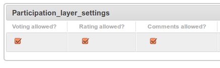

.. _participation-label:
=============
Participation
=============
The participation module makes possible, for registered users, the insertion of participation data on nodes.

The actions that can be taken are:

**Vote** : 'like' or 'dislike' 

**Comment** :  comments on nodes

**Rating** : 1 to 10 rating

---------------
Settings
---------------

The modules ``nodeshot.layers`` and ``nodeshot.nodes``  need to be in ``settings.INSTALLED_APPS``::

    INSTALLED_APPS = [
        # dependencies
        'nodeshot.core.layers',
        'nodeshot.core.nodes',
        # ...
    ]
    
---------------
Configuration
---------------

Admins can configure which of the above actions can be taken through the Admin Interface.

Participation actions can be enabled or disabled for an entire **layer**:

Or for a single **node**:

.. image:: node_participation_settings.png

----
API
----

^^^^^^^^^^^^^^
Inserting data
^^^^^^^^^^^^^^

Comments, votes and ratings can be inserted through :ref:`Nodeshot API <api-label>` or :ref:`Open 311 API <open311-label>` .

^^^^^^^^^^^^^^
Querying data
^^^^^^^^^^^^^^

Participation details about nodes are available through :ref:`Nodeshot API <api-label>`.

In particular:

**http://<server-name>/api/v1/participation/**  will return participation data for all nodes

While:

**http://<server-name>/api/v1/<node_slug>/participation/** will return participation data for the specified node

