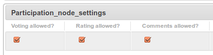

.. _participation-label:
=============
Participation
=============

``nodeshot.community.participation`` is a django apps that enables 3 features to make
the site more "social":

 * **Vote** : like or dislike
 * **Comment**: comments on nodes
 * **Rating**: 1 to 10 rating

``nodeshot.community.participation`` is enabled by default in ``nodeshot.conf.settings.INSTALLED_APPS``.

--------------
How to disable
--------------

If you need to disable this feature altogether add this at the bottom of your ``settings.py``:

.. code-block:: python

    INSTALLED_APPS.remove('nodeshot.interop.open311')
    INSTALLED_APPS.remove('nodeshot.community.participation')

-------------
Configuration
-------------

Admins can configure which of the above actions can be taken through the Admin Interface.

Participation actions can be enabled or disabled for an entire **layer**:

.. image:: images/layer_participation_settings.png

Or for a single **node**:

---
API
---

^^^^^^^^^^^^^^
Inserting data
^^^^^^^^^^^^^^

Comments, votes and ratings can be inserted through :ref:`Nodeshot API <api-label>` or :ref:`Open 311 API <open311-label>` .

^^^^^^^^^^^^^^
Querying data
^^^^^^^^^^^^^^

Participation details about nodes are available through :ref:`Nodeshot API <api-label>`.

In particular:

**http://<server-name>/api/v1/participation/**  will return participation data for all nodes

While:

**http://<server-name>/api/v1/<node_slug>/participation/** will return participation data for the specified node
